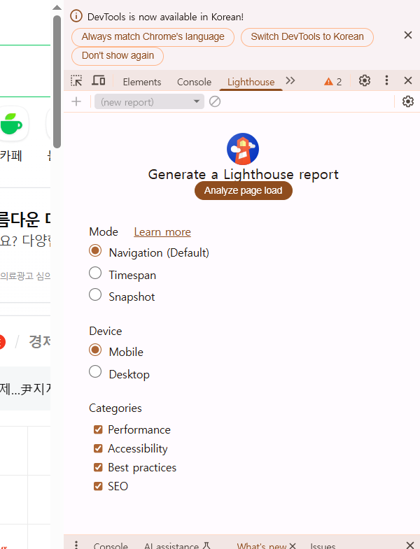
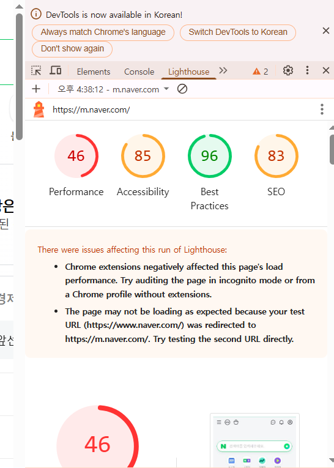
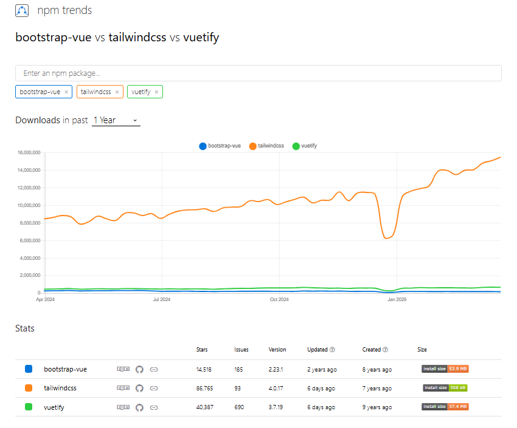

(1일차, 03/31)

1️⃣ UI/UX

😺 UI

- user interface
- 사용자가 컴퓨터나 스마트폰, 웹사이트, 애플리케이션 등과 상호작용하는 방식

😺 UX

- user experience
- ui를 통해 사용자가 경험할 수 있는 전반적인 것들

😺 어떤게 ui? ux?

- ui : 인터페이스 그 자체(눈에 보이는 것들) - view task 버튼, 종 모양, 하단 버튼들, 프로필 이미지 사진, in progress의 슬라이드(카드) 형태 등 홈페이지에서 클릭 가능한 것들 ..
- ux : 버튼을 눌렀을 때 이루어질 수 있는 후속적인 것들(사용자에게 전달하는 경험)

\*\* ux 디자이너 : 사용자의 편리성을 고려한 디자인의 배치를 담당(개선), 최적의 경험 제공

ui는 가장 작은 개념 !
FE ⊃ UX ⊃ UI

😺 프론트앤드 개발자가 하는 일

1. UI 디자인을 "직접 구현"해야 함
2. 인터렉티브하며 동적인 애플리케이션을 개발하는 역할
3. HTML, CSS, JavaScript를 비롯해 React, Vue.js 같은 프론트엔드 기술, 프레임워크, 라이브러리에 대한 전문적인 지식 보유
4. UI/UX 디자이너와 긴밀히 협력하여 웹 또는 모바일 애플리케이션의 디자인 콘셉트를 이해하고 구현해야 함
5. 최신 프론트엔드 기술 동향과 모범 사례를 지속적으로 학습하고 반영
6. 코드 에디터, 버전 관리 시스템, 빌드 도구 등 다양한 개발 도구를 활용해 작업 효율을 높이고 팀원들과 효과적으로 협업

Q&A) UI와 UX를 구분하는 것이 개발시에 어떤점이 이득?
-> FE 개발자는 디자인적인 시각을 가져야 더 나은 결과물을 만들 수 있음, 디자이너와 긴밀한 협업 시 용이

---

2️⃣ Flex Box Layout (./lrn01/02/01)
: 가로나 세로, 둘 중 한 방향으로만 레이아웃을 설정할때 사용하는 것

왼 -> 오 방향에 대한 축을 가짐(main 축) : flex box의 진행방향(가로)
main 축과 상반되는 교차축이 있음
flex container : 가장 외부에 존재
flex item

Q&A) class 작성 시 '\_\_'쓰는 이유
-> css에서 스타일을 작성하는 방법 중 하나인 B(Block).E(Element).M(Modifier) 방법론임

- BEM의 가장 큰 특징 :
  .layout .sidebar -> 이런 식으로 꼬리를 물지 않음 !
  고유하게 작성 가능

ex. 블록이름\_\_요소이름
sidebar\_\_nav
header\_\_title

Q&A) css 속성 작성 차례에 따라 내용이 달라질 수 있나요?

속성을 작성하는 차례의 컨벤션을 찾아보면 기업마다 다른데, 가독성만을 위해서 존재하는지 궁금합니다

---

\*\*tip

- tailwind css 배워보기 : 유료강의 결제는 비추(그럼에도 불구하고 듣고 싶다면..4.0이상만)

- css는 점수개념 존재(./lrn01/cssEx.html)
  자세히 적으면 적을 수록 우선순위 높아짐
  또는 !important 사용해 우선순위 높이기

---

3️⃣ Grid(./lrn01/03/1)
행과 열로 구성되어있는 2차원의 표

Grid Container
Grid Cell : 한칸 한칸
Grid item : 실질적인 요소
Grid Line
Grid Number
Grid Gap

개발자 도구(F12)에서 grid 버튼 클릭해
grid 구성요소 시각적으로 확인할 수 있음

\*\* justify vs align

- justify : 보통 수평 기준으로 정렬
- align : 보통 수직 기준으로 정렬

---

4️⃣ 미디어 쿼리(Media Query)
(./lrn01/03/1/mediaQuery.html)

- 미디어에 따라 적용되도록 하는 쿼리(문법)
- css에서 화면 크기, 방향, 해상도, 기기 종류 등에 따라 다른 스타일을 적용할 수 있게 해주는 기능

😺 반응형 디자인과 적응형 디자인

- 적응형 : 특정 해상도에 따른 css 코드를 동기처리(미디어 쿼리 사용)
- 반응형 : 미디어 쿼리 없이 순수하게 반응형 단위를 사용해 코드를 작성(스타일 변화x)

😺 미디어 쿼리 문법
@media [미디어 타입] and (조건){

<!-- 조건에 따른 스타일 -->

}

- 미디어 타입 : all(default), screen(pc,mobile 등), print(인쇄용 프린터), speech(스크린 리더와 같은 음성 출력 장치)

- 조건 : ⭐min-width, ⭐max-width, min-height, max-height, orientation, resolution

---

5️⃣ CSS로 UI 컴포넌트 생성(./lrn/05)

- UI 컴포넌트 : 독립되어있는 UI 하나하나(작은 단위)
- 시중에 많은 사이트 존재
  https://ionicframework.com/docs/

---

6️⃣ 인터렉션 디자인(./lrn/06)

- 사용자가 웹 인터페이스와 상호작용할 때의 경험을 설계하는 것을 말함
- 클릭, 터치, 전환, 피드백, 애니메이션 등의 디테일을 통해 사용성과 만족도를 높이는 것이 핵심

- 인터렉션 디자인의 5원칙

1. 명확성 - 사용자에게 무엇이 가능한지 명확히 전달
2. 피드백 - 사용자 행동에 대한 즉각적인 반응 제공
3. 일관성 - UI 요소의 동작과 스타일이 일관되어야 함
4. 유도성 - 버튼, 링크 등은 누을 수 있음을 시각적으로 암시해야 함
5. 효율성 - 최소한의 행동으로 목표를 달성할 수 있어야 함

---

\*\*

- % : width, height, border-radius 제외하고는 사용 x, 비율 (부모 영역의 고정 크기에 대한 비율)
- 적응형을 위해 rem(루트em) 사용 권장 !

\*\* CSS의 애니메이션 참고 사이트
https://animate.style/

\*\* Flex 참고 사이트
https://developer.mozilla.org/ko/docs/Web/CSS/flex

\*\* 웹브라우저 호환성 확인 사이트
https://caniuse.com/

\*\* Flexbox Froggy -> flexbox 연습 사이트
https://flexboxfroggy.com/#ko

\*\* CSS 연습 게임  
https://flukeout.github.io/

---

(2일차, 04/01)

😺 WAI-ARIA (./lrn02/02/wai-aria.html)

1️⃣ 웹 접근성(Web Accessibility)
-> 장애 유무, 환경, 연령에 관계 없이 누구나 웹 콘텐츠에 접근하고 이용할 수 있도록 하는 것을 의미,

"웹은 평등해야 한다."

- 왜 필요한가 ?
  -> 시각, 청각, 지체 장애를 가진 사용자들도 웹을 사용할 수 있도록 함
  -> 고령자, 일시적 장애(팔 골절 등)도 포함
  -> 법적 규제(장애인 차별 금지법)에 따라서 준수 필요
  -> 검색 엔진 최적화(SEO)와 연관이 있을 수 있음

- 웹 접근성을 지키는 방법

1.  시멘틱 태그(header, main, nav, section, article, footer, aside 등) 사용
    -> HTML4 -> HTML5 업데이트 되면서 시멘틱 태그 추가
    -> 태그 자체에 의미를 부여하는 것
    -> div로 모든 페이지를 만들 수 있지만, 태그에 의미가 없음(only style용 목적)
    \*\* section : 구역(최근 인기 상품, 신발, 가방 ,,)
    \*\* article : 하나의 요소가 독립적인 콘텐츠, section 내부의 요소 하나(상품 하나)

⭐시멘틱 태그 사용 이유

- 스크린 리더기 : 웹페이지를 음성으로 읽어주는 보조 도구
  시멘틱 태그의 의미를 보고 읽어줌. 태그의 명확성을 높여줌으로써 지루함을 줄여준다

2.  WAI-ARIA (HTML 태그에서 사용할 수 있는 속성)
    -> HTML 만으로는 접근성을 표현하기 어려운 동적 콘텐츠를 보완하기 위한 속성
    -> (슈퍼 고급 개념)

    대표 속성
    -> role : 요소의 역할을 지정할 때 사용 \*\*
    -> aria-label : 시각적 텍스트 대신 스크린 리더용 설명을 제공 \*\*
    -> aria-labelledby : 다른 요소를 설명 텍스트로 사용
    -> aria-hidden : 보조 기술(스크린 리더기) 무시하게 하는 속성
    -> aria-expanded : 확장/축소 가능 여부를 표시하는 속성
    -> aria-selected : 현재 선택된 항목 표시 속성
    -> aria-describedby : 어떤 요소를 설명할 때 사용

⭐⭐ 웹 접근성 고려하며 프로젝트 했음을 어필하면 goood ! ⭐⭐

---

😺 성능최적화와 사용자 경험

1️⃣ 성능 최적화 (./lrn02/02/1/optimization.html)

- 페이지 로딩 속도를 최적화
  1.1 성능 최적화가 중요한 이유

- 사용자 이탈율이 감소 (웹 페이지 1초가 늦어지면 이탈율 32% 증가)
- 검색 엔진 최적화(SEO)에 긍정적인 영향
- 사용자 만족도 ↑, 전환율 ↑
  ex) 토스(toss)
  -> 인터넷 뱅킹 -> 토스(슬로건 : 금융을 쉽게) 출시

2️⃣ 성능 최적화 방법

2.1 이미지 최적화

- jpeg, png -> 압축해서 사용(1M -> 3sec) (100kb -> 0.02sec), webp
- https://tinypng.com/ (이미지 압축 사이트 이용)

  ⭐ 이미지 압축 원리 :
  이미지는 '문자열'로 이루어져 있음(binary)
  문자열 간의 불필요한 공백을 제거하는 것
  -> https://www.base64-image.de/ (이미지 문자열 추출 사이트)

  \*\*svg 확장자 : 이미지 절대 깨지지 않음

- lazy loading 기법 (./lrn02/02/2/lazy-load.html)
  -> 이미지 리소스에 대한 기능을 필요할 때만 다운로드
  단점 : 필요할 때 다운받기 때문에..
  초기에 이미지를 불러오는 리스크를 감수하더라도 로딩이 빨라야 하는 사이트에서는 안쓰는게 좋음

  상황에 따라 사용하자 !

  2.2 폰트 최적화

- 언어셋, 대부분의 폰트는 모든 언어셋 지원
- ex) Noto Sans, -> 영어, 프랑스어, 베트남어, 독일어, 한국어 등 포함 -> 한국에서만 타겟팅한다면 나머지 언어 필요치 않음

  - https://gwfh.mranftl.com/fonts (언어 지정 후 다운 가능)

    2.3 불필요한 리렌더링 최소화

- vue는 자동으로 리렌더링 최적화함(리액트는 x)

  2.4 Lawy Load -> 지연 로딩(리소스를 지연해서 로딩)

  2.5 성능 측정 도구 (LightHouse)

  2.3 vue project에서의 최적화
  [./lrm02/3/3]

- vue파일 생성시
  npm init vue
  npm create vue
  npm create vue@latest (공식 문서, latest: 가장 최신 버전 다운)

추천방법
npm create vue@latest .
-> '.' : 별도의 폴더 생성 없이 현재 폴더에 생성됨

- ★★★★ES Lint : js의 문법적 규칙을 검사해주는 도구
  ★★★★장점 -> 정확하고 통일성 good
  ★★★★단점 -> 신경써야 하는게 많음
  ==>★★ 필수 체크 권장 !! 나중에 올 혼란 최소화 가능
  ★★★★미리미리 문법에 대한 검증을 거치며 연습하기

⭐ component에 대한 lazy loading

1. Home에서는 About.vue가 필요치 않으므로 불러오지 않음

[./3/src/router/index.js] line 17
// which is lazy-loaded when the route is visited.
-> 필요하지 않으면 미리 불러오지 않겠다는 의미
-> router 설치 시 자동 설정

2.  직접 lazy load 처리하기
    => About.vue에서 불필요한 파일 다운받지 않는 방식 !

[HomeView.vue]
const TheWelcome = defineAsyncComponent(() => import('../components/TheWelcome.vue'))

\*\* 자주 방문하지 않는(중요도가 떨어지는) component를 lazy load 처리해놓으면 훨씬 효율적임
(회장인삿말 등등)

\*\* lazy load를 사용하지 않는다고 해서 DB query 성능에는 아무 영향 x

\*\* (관례상) main 페이지는 lazy load를 하지 않는다
(사용자가 가장 방문 多)

---

🔨 기존의 options API에 setup을 생성해줌으로써 composition API를 사용할 수 있게 배려해준 것,
but composition API만 사용하기 어려움

=> <script setup> 출시

--- 🔨 npm (node package manager)
| -> 최초로 js 실행할 수 있게 함, 안정성이 높음
| 단점 : 싱글 쓰레드 기반(일 할 수 있는 일꾼이 한명,,
| 한 번에 한 가지 일만 수행)
| js 패키지가 많을 수록 속도 저하
| 🔨 yarn
| -> 멀티 쓰레드 방식(일꾼 여러명)
| -> npm보다 패키지를 설치, 실행 속도 빠름, 시장 장악력은 약함
|
---> 🔨 pnpm : 멀티쓰레드 방식
.
.
.

🔨 권장 공부 순서
html -> css -> js -> vue -> typescript -> typescript 기반 react

---

😺 UI/UX 테스트 및 피드백

1. A/B 테스트

(가장 단순, 원초적)

- 두 가지 이상의 디자인/기능 버전을 사용자에게 무작위로 제공하고, 성과를 비교하여 최적의 버전을 선정하는 실험 방식

2. Lighthouse 테스트

(개발자 도구 -> Lighthouse)
점수에 대한 지표 확인 가능

3. 히트맵 분석

- 사용자의 시선이나 클릭이 집중되는 지점을 시각적으로 분석
- 외부 솔루션 사용해야 함(내장x)
- hotjar(https://www.hotjar.com/)

* jest, vitest 등

---

https://npmtrends.com/
: 뭐가 대세인지 파악할 때 참고할만한 사이트

한 눈에 비교분석 가능 !

---

😺 리액트
(⭐⭐⭐ : 현업에서 주로 사용)

1. 전통적인 방법

- 인라인 스타일 

- 글로벌 스타일 .css
- CSS 모듈 ⭐⭐⭐

2. CSS-IN-JS

- styled-components ⭐⭐⭐
- emotion ⭐⭐⭐
- vanilla extract

3. 테일윈드 CSS -> 강사님 추천 ~~⭐
