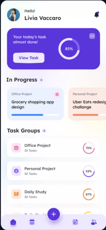

1️⃣ UI/UX

😺 UI

- user interface
- 사용자가 컴퓨터나 스마트폰, 웹사이트, 애플리케이션 등과 상호작용하는 방식

😺 UX

- user experience
- ui를 통해 사용자가 경험할 수 있는 전반적인 것들

😺 어떤게 ui? ux?

- ui : 인터페이스 그 자체(눈에 보이는 것들) - view task 버튼, 종 모양, 하단 버튼들, 프로필 이미지 사진, in progress의 슬라이드(카드) 형태 등 홈페이지에서 클릭 가능한 것들 ..
- ux : 버튼을 눌렀을 때 이루어질 수 있는 후속적인 것들(사용자에게 전달하는 경험)

\*\* ux 디자이너 : 사용자의 편리성을 고려한 디자인의 배치를 담당(개선), 최적의 경험 제공

ui는 가장 작은 개념 !
FE ⊃ UX ⊃ UI

😺 프론트앤드 개발자가 하는 일

1. UI 디자인을 "직접 구현"해야 함
2. 인터렉티브하며 동적인 애플리케이션을 개발하는 역할
3. HTML, CSS, JavaScript를 비롯해 React, Vue.js 같은 프론트엔드 기술, 프레임워크, 라이브러리에 대한 전문적인 지식 보유
4. UI/UX 디자이너와 긴밀히 협력하여 웹 또는 모바일 애플리케이션의 디자인 콘셉트를 이해하고 구현해야 함
5. 최신 프론트엔드 기술 동향과 모범 사례를 지속적으로 학습하고 반영
6. 코드 에디터, 버전 관리 시스템, 빌드 도구 등 다양한 개발 도구를 활용해 작업 효율을 높이고 팀원들과 효과적으로 협업

Q&A) UI와 UX를 구분하는 것이 개발시에 어떤점이 이득?
-> FE 개발자는 디자인적인 시각을 가져야 더 나은 결과물을 만들 수 있음, 디자이너와 긴밀한 협업 시 용이

---

2️⃣ Flex Box Layout (./lrn01/02/01)
: 가로나 세로, 둘 중 한 방향으로만 레이아웃을 설정할때 사용하는 것

왼 -> 오 방향에 대한 축을 가짐(main 축) : flex box의 진행방향(가로)
main 축과 상반되는 교차축이 있음
flex container : 가장 외부에 존재
flex item

Q&A) class 작성 시 '\_\_'쓰는 이유
-> css에서 스타일을 작성하는 방법 중 하나인 B(Block).E(Element).M(Modifier) 방법론임

- BEM의 가장 큰 특징 :
  .layout .sidebar -> 이런 식으로 꼬리를 물지 않음 !
  고유하게 작성 가능

ex. 블록이름\_\_요소이름
sidebar\_\_nav
header\_\_title

Q&A) css 속성 작성 차례에 따라 내용이 달라질 수 있나요?

속성을 작성하는 차례의 컨벤션을 찾아보면 기업마다 다른데, 가독성만을 위해서 존재하는지 궁금합니다

---

\*\*tip

- tailwind css 배워보기 : 유료강의 결제는 비추(그럼에도 불구하고 듣고 싶다면..4.0이상만)

- css는 점수개념 존재(cssEx.html)
  자세히 적으면 적을 수록 우선순위 높아짐
  또는 !important 사용해 우선순위 높이기

---

3️⃣ Grid(./lrn01/03/1)
행과 열로 구성되어있는 2차원의 표

Grid Container
Grid Cell : 한칸 한칸
Grid item : 실질적인 요소
Grid Line
Grid Number
Grid Gap

개발자 도구(F12)에서 grid 버튼 클릭해
grid 구성요소 시각적으로 확인할 수 있음

\*\* justify vs align

- justify : 보통 수평 기준으로 정렬
- align : 보통 수직 기준으로 정렬

---

4️⃣ 미디어 쿼리(Media Query)
(mediaQuery.html)

- 미디어에 따라 적용되도록 하는 쿼리(문법)
- css에서 화면 크기, 방향, 해상도, 기기 종류 등에 따라 다른 스타일을 적용할 수 있게 해주는 기능

😺 반응형 디자인과 적응형 디자인

- 적응형 : 특정 해상도에 따른 css 코드를 동기처리(미디어 쿼리 사용)
- 반응형 : 미디어 쿼리 없이 순수하게 반응형 단위를 사용해 코드를 작성(스타일 변화x)

😺 미디어 쿼리 문법
@media [미디어 타입] and (조건){

<!-- 조건에 따른 스타일 -->

}

- 미디어 타입 : all(default), screen(pc,mobile 등), print(인쇄용 프린터), speech(스크린 리더와 같은 음성 출력 장치)

- 조건 : ⭐min-width, ⭐max-width, min-height, max-height, orientation, resolution

---

5️⃣ CSS로 UI 컴포넌트 생성(./lrn/05)

- UI 컴포넌트 : 독립되어있는 UI 하나하나(작은 단위)
- 시중에 많은 사이트 존재
  https://ionicframework.com/docs/

---

6️⃣ 인터렉션 디자인(./lrn/06)

- 사용자가 웹 인터페이스와 상호작용할 때의 경험을 설계하는 것을 말함
- 클릭, 터치, 전환, 피드백, 애니메이션 등의 디테일을 통해 사용성과 만족도를 높이는 것이 핵심

- 인터렉션 디자인의 5원칙

1. 명확성 - 사용자에게 무엇이 가능한지 명확히 전달
2. 피드백 - 사용자 행동에 대한 즉각적인 반응 제공
3. 일관성 - UI 요소의 동작과 스타일이 일관되어야 함
4. 유도성 - 버튼, 링크 등은 누을 수 있음을 시각적으로 암시해야 함
5. 효율성 - 최소한의 행동으로 목표를 달성할 수 있어야 함

---

\*\*

- % : width, height, border-radius 제외하고는 사용 x, 비율 (부모 영역의 고정 크기에 대한 비율)
- 적응형을 위해 rem(루트em) 사용 권장 !

\*\* CSS의 애니메이션 참고 사이트
https://animate.style/

\*\* Flex 참고 사이트
https://developer.mozilla.org/ko/docs/Web/CSS/flex

\*\* 웹브라우저 호환성 확인 사이트
https://caniuse.com/

\*\* Flexbox Froggy -> flexbox 연습 사이트
https://flexboxfroggy.com/#ko

\*\* CSS 연습 게임  
https://flukeout.github.io/
